# What is geomorphology?

**2026-08-26**

- The study of landforms and the processes that create them
- Study of Earth's dynamic surface, its history, and its active processes
- Around since Ancient Greece, but term coined in late 1800s

> “Geomorphologists learn to observe and interpret landscapes systematically in order to understand how processes shape Earth’s surface, decipher the history of a place, and recognize (and potentially mitigate or manage) the impacts of environmental hazards on societies”
> 
> --- Bierman and Montgomery, 2014

**Interdisciplinary science**

- Synthetic science: geography, geology, physics, chemistry, biology, etc.
- Qualitative & quantitative
- Nexus of lithosphere (geosphere), hydrosphere, biosphere, atmosphere

## Facets of geomorphology

- Morphology (static)
    - Constitution
    - Configuration
    - Mass flow (discharge, precipitation rate, sediment flux---still static rates of flow)
- Dynamic variables
    - Chemical & mechanical properties representing energy expenditure & doing of work (power, force, stress, momentum, etc.)
    
Beach example (in PPT)

## Approaches

- In US, geomorphology courses taught in both physical geography & geology departments
- In the past, focus on description and classification of landforms to inform landscape history
- Since 1950s (or a bit earlier in the century), push toward quantitative characterisation and understanding of *process* (especially physical and chemical processes)

## Themes

Lots of themes, lots of valid dichotomies

- Reductionism vs synthesis
- Quantitative vs qualitative
- Complexity vs similarity
- Mechanistic (process) vs event/extremal hypotheses
- High-tech vs low-tech
- Large vs small scales
- Field vs lab/numerical modelling studies
- REMOTE SENSING

## Historical geomorphology

- Study of landform genesis & evolution over medium to long time scales
- WM Davis (geographer, one of founders of AAG) introduced concept of The Geographical Cycle: landscapes undergo initial and sudden uplift, then geomorphic processes continue gradually wearing down topography (increase in relief). Stages are youthful, mature, old age.
- Especially these terminologies were very simplistic, and not very popular now.
- Currently, relies on advanced dating techniques to reconstruct Quaternary history of a region (now--2.5mya)

## Process geomorphology

- Study of processes responsible for landform development & geomorphic change
- GK Gilbert defined (1877, *Geology of Henry Mountains*) concept of **dynamic equilibrium** between driving forces and resistance of geologic structure
    - Father of modern geomorphology: first to associate mechanical principles with geomorphic action
    - USGS, background in physics and geology
    - President of GSA & AAG
- Post-Gilbert:
    - Robert Horton: hydrophysical approaches to study fluvial systems
    - Arthur Strahler: advocated for dynamic geomorphology
    - 1950s--60s: explosion of quantitative process-based studies, emphasis on equilibrium (self-regulation) in fluvial systems (systems concepts)
    - 1970s: slow shift to disequilibrium
    - 1980s: renewed interest in systems approaches
    - 1990s--recent: non-linear dynamics, numerical & physical modelling, sophistication of field techniques & tech
    - Morphodynamics: study of landscape evolution as it relates to deposition and erosion of sediment (Gary Parker)
    
**Arguments against (1980s)**

- Small scale processes, reductionism
- Emphasis on applied (becoming nothing more than engineering)
- "The re-enchantment of geomorphology", Vic Baker and Rollie Twidale (1991)

## Reenchanctment of geomorphology

- Critical of Process Geomorphology (4 main concerns)
    - Anti-historicism (ignoring rare/extreme events)
    - Over-reliance on physical theory (theoreticism diverts attention from observation, first step of scientific method)
    - Increasing emphasis on applied studies: becoming engineering, application should not drive science
    - Over-emphasis on modelling: sophistication replacing accuracy
- Solution: **maverick geomorphology** (anomalies, creativity & discovery, non-theoretical historical studies)

## Subgroups of geomorphology

- Tectonic: interaction between tectonic & geomorphic processes where crust actively deforms; interest in orogenies (mountain building)
- Climatic: some proponents suggest climatic zones (tropics, arid, etc.) engenders a distinctive suite of landforms, but highly contested, more to it (though climate does have strong influence)
    - Physiographic provinces: at regional scales, tectonic forces and climatic conditions create distinct provinces, producing similar landforms
- Hydro-: hydrology + geomorphology
- Bio-/eco- (plants or animals)
- Biomorphodynamics: biological-physical feedbacks between animals and plants and physical geomorphic processes
- Anthropo-, submarine, planetary (lots more)
- Exact terms don't matter, conceptual syntheses

Fig 1. from Steiger & Corenblit 2012 is nice for my perspective. But Kory disagrees with bio- being only passive manipulators of Earth surface processes (also active).

# Methods for Geomorphic Science

**2026-08-28**

## Common variables of interest

- Water velocity and discharge (volumetric flow rate)
    - Classic propeller-meters for 1d measurement
    - Acoustic Doppler Velocimeter for 3d velocity components (at-a-point, time-series)
    - Acoustic Doppler Current Profiler (ADCP): newer, good for larger faster sampling
    - Large-scale particle image velocimetry (LS-PIV): originated as lab method; add some particle and measure its flow
- Channel morphology
    - Width, depth
    - Bed, bedform
    - Bankline delineation, bank roughness
    - Direct field surveying (total station, GPS)
    - Remote sensed: 
    - LiDAR great for "subtracting" vegetation (aerial), also high-res imaging especially vertical (terrestrial, TLS)
    - Drones: morphologic and sedimentological mapping
    - Structure from mapping
    - River bathymetry mapping: LiDAR doesn't work well with water (mostly due to sediment), but Multibeam Echo Sounding (MBES) is high-res, mount on boat and go across river; hydroacoustics, get multiple streams of info about elevation (1000 pings per swath, ADCP only 4); ADCP maps velocities, MBES maps river and coastal beds
- Mapping subsurface
    - Ground Penetrating Radar (GPR): cart pulled across ground
    - Sediment and soil coring: manual hammering or vibracore (vibrating weight on top)
        - Sizing: Dry sieving (Roto-tap) with multiple sieves, gives grain size distribution (proportional masses)
- Numerical Morphodynamic Modelling
- Satellite remote sensing, automated river migration methods

## Basic principles of Geomorphology

**2026-08-31**

- Systems science
    - System: set of interrelated things linked by flows (input-output) and distinct from surrounding environment (input-output cross some boundary)
    - Each geomorphic system (e.g., rivers) is its own system
    - Input minus output = storage change ($I - O = \Delta ST$; Conservation Laws of Mass and Energy)
    - Types of systems:
        - Open: exchange both energy and matter with surrounding environment (most geomorphic systems)
        - Closed: exchange only energy with surrounding environment (global concepts, e.g., hydrological system)
        - Isolated: cannot exchange energy or matter with surrounding environment (theoretical concept)
    - Feedbacks
        - As systems operate, generate outputs that influence aspects of the system---**feedbacks**
        - **Feedback loop**: pathway that information about system travels between various points of system (snowball vs self-regulation)
- Uniformitarianism
    - In late 19th century, shift from catastrophism to uniformitarianism
    - **Catastrophism:** change by sudden, rapid, violent events (doesn't require long periods of time)
    - **Gradualism:** slow, gradual change (long periods of time); introduced by James Hutton in *Theory of the Earth* (1795)
    - **Uniformitarianism:** 
        - laws of physics and natural processes operating today are same as those in past (vast, long geologic history)
        - Charles Lyell in *Principles of Geology* (1830)
        - includes both slow changes and major events (floods, earthquakes)
- Principles of Equilibrium, Thresholds & Complex Response 
    - Delicate balance between landforms and processes
    - Always consider driving forces vs resisting forces
    - **Steady-state:** rates of input and output are equal; system maintains time-averaged level
    - **Metastable/Complex Response:** when system reaches some **threshold** (tipping point), it abruptly shifts to a different state which may later reach steady-state equilibrium
    - **Dynamic:** (depends on time scale of interest) appears in steady-state over short term, but there is some trend over long term
    - Evaluating a system's equilibrium condition requires consideration of temporal scale & capabilities to assess change over that time period
- Process-form relationship
    - Mediated by energy, force and resistance (driving vs resisting force)
    - We can view a lot of our systems through the framework of what's trying to do the work and what's trying to hold it in place
- Recurrence Intervals & Magnitude-Frequency relationships
    - Most geomorphic change comes from discrete events of varying size and scale (therefore, magnitude)
    - RI: average time between events of a given magnitude
    - Aug 2016 in Baton Rouge (Lafayette to Slidell): huge flood, magnitude super high (500-1000 year event), but doesn't mean we cannot have similar in the near future
    - Using all these in analyses (especially predicting large events) requires that the system we're modelling doesn't change in properties, but this is generally not the case
- Landscapes based on sensitivity
    - **Insensitive/robust:** steady-state, "buffering", system responds fast to external forces
    - **Sensitive:** slow to response to external forces, or timing of forces faster than response; complex response
    - Landscape Sensitivity based on transient-form ratio (mean recovery time/mean recurrence interval): larger $TF_r$ means more sensitive landscape
    
$$
TF_r = \frac{t_r}{t_d}
$$

# Endogenic Processes & Earth Basics

- **Endogenic:** internal processes related to movement of lithosphere (tectnoics) and/or eruption of molten rock (volcanism)
    - Responsible generally for increasing elevation of landscapes
    - Generally build up (driving force)
    - Larger time scales
- **Exogenic:** external processes related to overall wearing down of landscapes (weather, water, wind, ice)
    - Generally wearing down (resisting force)

## Geologic Time Scale

**2026-09-02**

- Eons --> Eras --> Periods --> Epochs
- Precambrian eon actually has 3 eons, but largely grouped together
- Boundaries based on key events in Earth's history (Earth's physical form, atmospheric composition, evolution/dominance of various forms of life)
    - Precambrian-Phanerozoic boundary represents **Cambrian Explosion**: modern atmospheric composition & variety and complexity of life increased rapidly and enormously (suddenly lots of fossils)
    - Within Phanerozoic, based on extinctions and evolution
    - PT extinction (largest) was due to volcanic activity, not asteroid
- Cenozoic: modern is Palaeogene, Neogene, Quaternary
    - Pleistocene = last glaciation (2.6mya--10kya)
    - Strong push to add Anthropocene Epoch to GTS: when? Weapons of mass destruction (mid-1900s), or *industrialisation*?
        - Only scientific argument against: we don't know what the *lasting evidence* will be, cos no historical record as such to track

## Earth's interior

- Internal heat drives endogenic processes
- Core (50%): inner is solid iron, outer is molten iron
    - Heat from compaction during formation, and from radioactive decay
    - Heat allows mantle elements to move (mantle convection)
- Uppermost mantle is rigid but much denser than crust above
- Crust vs mantle (density); lithosphere vs asthenosphere (rigidity)
- Top 1% is crust: continental (granite; thicker; slightly less dense) & oceanic (basalt; thinner; slightly denser)
    - **Isostasy:** adjustment of asthenosphere to lithosphere based on density-thickness differences; keeps gravity and buoyancy in equilibrium; erosion of crust might result in uplift of plate
    - Spatial distribution of both crust types across globe different

## Plate tectonics

- Seven major tectonic plates
- Only around 1960s correlational evidence among plate shapes, earthquake hotspots, and volcanic activity came together to conceptualise plate tectonics
    - Only after WWII! With more geophysical evidence, pinpoint *how* these movements happen
    - **How:** mantle convection + gravity
    - Earlier concepts thought of continents as icebergs in the oceanic sea
    - But now we know the whole lithospheric crust moves
    - Zero sum game: volcanic activity builds material, on the other end **subduction**
        - Gravity pulls one plate below another through subduction (usually in basaltic ocean crust); mantle convection adds new material atop the crust
- **Tectonic boundaries:** divergent, transform, convergent
- Continent-continent convergent boundaries: **suture zones** (no scope for subduction due to thickness, equal density) resulting in orogeny
- Ocean-continent convergence: subduction due to oceanic being denser and thinner
- Ocean-ocean: older colder (denser) oceanic subducts under younger 
- When plate gets subducted: 
    - Part of it starts melting, becomes less dense, and results in more volcanic activity
    - The higher plate also "scrapes" off subducted plate, either forming some wedge or collecting smaller islands 
- **Bowen's reaction series:** sequence in which minerals crystallise/melt from magma/rock
    - High to low temperature increases silica content (earliest rocks formed have lower, latest/youngest have more silica)
    - Silica content determines resistance to breaking down at Earth's surface (more silica, more resistant; e.g., sand on beaches)

**2026-09-04**

Rock type and characteristics (lithology) is important because determines structure and resisting forces; differential weathering produces relief

## Rock types

- Igneous: cooling and solidification of magma/lava
- Metamorphic: transformation of existing rock via pressure and/or heat
- Sedimentary: deposition + subsequent lithification (cementation & compaction) of mineral and/or organic particles
- So it's actually a **rock cycle** 
- Majority of rock at Earth's surface is sedimentary, although the crust just below is mostly igneous
- In any given climate, each rock type respons to weather & erosion in a different manner and a different rate
- High-standing landmasses should be underlain by resistant rock, while low-standing formed from rocks more susceptible to erosion
- Climatic factors
    - Insolation
    - Albedo
    - Energy gradients (atmospheric & oceanic circulations)
    - Orographic effects (e.g., rain shadows)

# Tectonic Geomorphology

**2026-09-09**

- Study of landforms and landscapes which recor a measureable tectonic signal
- Typically large scale, but sometimes smaller scale landforms
- Tectonic processes generally elevate rocks above sea level where weathering (exogenic process) prepares rock materials for sculpting into landscapes via erosion (wind, water, ice)
- Can also have lowering of surface (rifting)
- Uplift can occur not just via tectonics but also isostatic rebound

## Uplift & exhumation

- **Rock uplift:** changes in a rock's vertical position relative to a fixed datum (e.g., sea level, t0)
- **Surface uplift:** change in elevation of the land surface relative to fixed datum
- **Exhumation:** unburial of rock below by removal of material above; rock uplift without surface uplift (via surface erosion), mean elevation of landscape remains constant
    - In other words, surface uplift is rock uplift minus exhumation
    
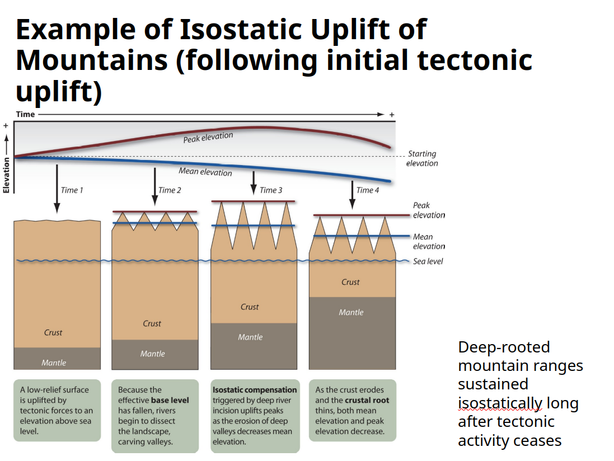

- **Lithospheric flexure:** downwarping directly below load (e.g., mountain, glacier) and (cmpensatory) upwarping away from load; even due to basin sedimentation/loading (continental shelf causes upwarped fluvial terraces; foreland basin at the toe of compressional mountain range)
- **Thermal & density contrasts:** warmer, less dense crust rises above adjacent cooler crust; common with salt domes and diapirs; also rift zones, upwellings/hotspots
- Tectonic landforms dependent on tectonic setting (active, passing, intercontinental), lithology (resistance to erosion), structural geology (degree of fracturing, folding, faulting)

## Faults

- *Displacement* of rocks on either side of a fracture relative to the rocks on the other side (only cracking without displacement called jointing or fracturing)
- Fault plane parameters (both angles):
    - **Dip:** steepness of fault plane
    - **Strike:** orientation of fault plane relative to North
- **Dip-slip faults** mainly vertical motion; **strike-slip faults** usually horizontal with steep dip angle
- **Footwall:** the block *below* fault plane (<90deg); **Hanging wall:** block above fault plane
    - Terms from mining geology: usually lots of ore deposits in fault planes, so miners would hang lanterns on hanging wall and place feet on footwall
- **Normal fault:** footwall goes up, hanging wall goes down (hence a dip-slip, not strike-slip); requires pulling apart, release of pressure (*torsional stress*).
    - Series of normal faults can produces ridges (**horst/range**) and valleys (**graben/basin**); whole state of Nevada characterised by series of normal faults
- **Reverse fault:** footwall goes down, hanging wall goes up; requires pushing together or collision (*compressional stress*)
- **Thrust fault:** very low dip angle, one block rides over another; older rock/material ends up above younger one

### Extensional margins and landforms

 Extensional Landforms (normal faults).
 
- **Fault scarp:** part of fault plane exposed above the surface (normal faults)
    - Over time, weathering and erosion produces triangular facets, eventually back flat (but still older material on top of younger)
    
### Compressional settings and landforms

**2026-09-11**

- Typically involves upward lift, therefore orogeny (mountain building, crustal thickening)
    - Can have volcanism via subduction
    - Suture zones along continental-continental
    - Reverse & thrust faults
    - Folding

### Transform settings and landforms

- Transform boundaries are typically not perfectly straight, so can involve mix of compression and extension
    - Transtensional (releasing bend): results in grabens (valleys), drops in landscape; pull-apart basins
    - Transpressional (restraining bend): fault-zone parallel mountains; surface uplift via thrust faults
- Results in:
    - Offset channels or beheaded streams
    - Other offsets, like in built-up area
- Strike-slip fault direction: imagine on one block, then which direction has other block moved? (right-lateral, left-lateral)

## Folds

- Structural landforms: Differential weathering after tectonically uplifted rock declines or ceases
    - Folds and faults warp strata, weakening resistance to erosion, and bring different lithologies together in new proximity
- Fast force & brittle material: fault; slow force & ductile/sturdy material: fold; but needs to be *compression*
- **Anticline:** upfold/arch/buckle upward
- **Syncline:** downfold/trough/bow downward
- Both often found together
- When anticline/syncline happens followed by erosion, we get symmetric/concentric patterns at ground level (looking down)
    - Oldest in centre, youngest in outer---anticline
    - Youngest in centre, oldest in outer---syncline
- Anticline not necessarily higher than syncline; determined by resistance to erosion of material, and among the layers as well
    - Fold does not dictate topography, resistance of rock does
- **Monocline:** only one portion of rock layers folds down; normal faults deep down, but upper material more ductile, so folds together in one direction
    - Cuesta (<45deg), hogback (45deg), flatiron (>45deg)
- **Plunging folds:** when compressional force is not perpendicular to material, creates anticlines or synclines with dips
    - Anticlines V in direction of plunge; Synclines open in direction of plunge
    

### Arches National Park

<iframe title="Video Embed" src="https://www.nps.gov/media/video/embed.htm?id=285EAB03-155D-451F-675A179E29B97247" width="720" height="480" frameborder="0" scrolling="auto" allowfullscreen></iframe>

### Buttes & mesas

- Resistant cap rock, everything else weathered down

# Volcanic Geomorphology

**2026-09-14**

## Importance of igneous (volcanic) processes

- Main way to add crust (intrusive [stays underground] or extrusive volcanism)
- Through volcanism, changing the shape of Earth's surface (= geomorphology)
- Emitting gases that change weather & climate
- Effects on other systems: rivers, coasts, biosphere (ecological succession)

## Distribution & styles of volcanism

- Along plate boundaries (divergent boundaries, subduction zones at convergent boundaries) or within plates at hotspots (e.g., Hawaii)
    - All volcanism at divergent boundaries are extrusive (spreading centres); shallow earthquakes and volcanism
    - Convergent boundaries have deeper earthquakes/volcanism; can be oceanic-oceanic or oceanic-continental
    - Hotspots: spatially fixed in mantle (mantle plumes), and plate moves over, causing volcanism; old-young gradient of volcanoes

## Magma chemistry

- Igneous rock
    - **Large crystal:** slower cooling, crystals visible without microscope (coarse grain); cooling must have been underground
    - **Small crystal:** faster cooling, crystals invisible without microscope (fine grain)
    - **Glassy/vesicular crystal:** very fast, extrusive cooling (obsidian or pumice styles)
- Magma underground becomes lava aboveground
- Deeper in the ground --> slower cooling rocks
- **Malic:** magnesium & ferric; **Felsic:** feldspar & silica
- Most of oceanic crust high density (basalt), most of continental low density, silica-rich (granite)
- Lava viscosity
    - Measure of fluid's resistance to deformation; how much does it flow?
    - More silica --> more viscous (thicker)
    - **Explosivity:** high viscosity prevents escape of gases, building pressure, so greater explosivity
    - **Yield strength:** ability to resist flowing; when flow stops, shear stress (driving force) balanced by yield strength (resisting force)
    - Basaltic lava: mafic, low silica content; "aa" ([rough, jagged](https://www.youtube.com/watch?v=iyIV5fd1Aww )) or "pahoehoe" ([ropy cords](https://www.youtube.com/watch?v=v1h_BJA4QJU))
    - Volcanic Explosivity Index (VEI): logarithmic; consider volume of fragmented ejecta (not lava)

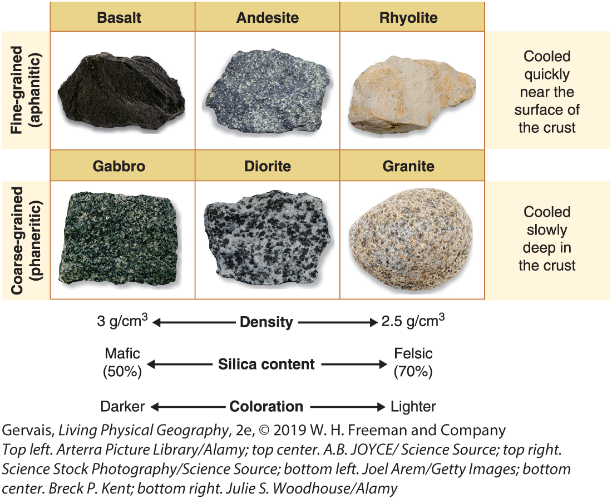

VEI of 4:

<iframe width="560" height="315" src="https://www.youtube.com/embed/BUREX8aFbMs?si=pMMTYBpeB18x28ve" title="YouTube video player" frameborder="0" allow="accelerometer; autoplay; clipboard-write; encrypted-media; gyroscope; picture-in-picture; web-share" referrerpolicy="strict-origin-when-cross-origin" allowfullscreen></iframe>

## Volcanic landscapes & morphology

- Eruptive products: lava flows, pyroclastic material, volcanic gases
- Flood basalts: extensive sheets of basaltic lava
    - Over long time, up to millions of years
- Shield: effusive eruptions (basaltic lava), gentle slopes
- Cinder cone: small accumulation of pyroclastics (scoria) from moderately explosive eruptions
    - Typically basaltic; short-lived
    - Combination of flows & pyroclastic ejecta
- Composite: mountain produced by series of explosive eruptions of lava, ash, rock, and pyroclastics
- Caldera: collapsed summit following eruption or loss of magma
- Dike: vertical intrusions through rock layers
- Sill: horizontal intrusions between rock layers

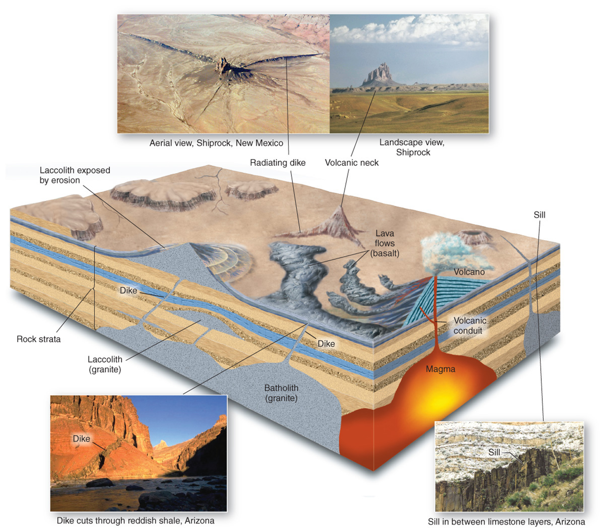
    
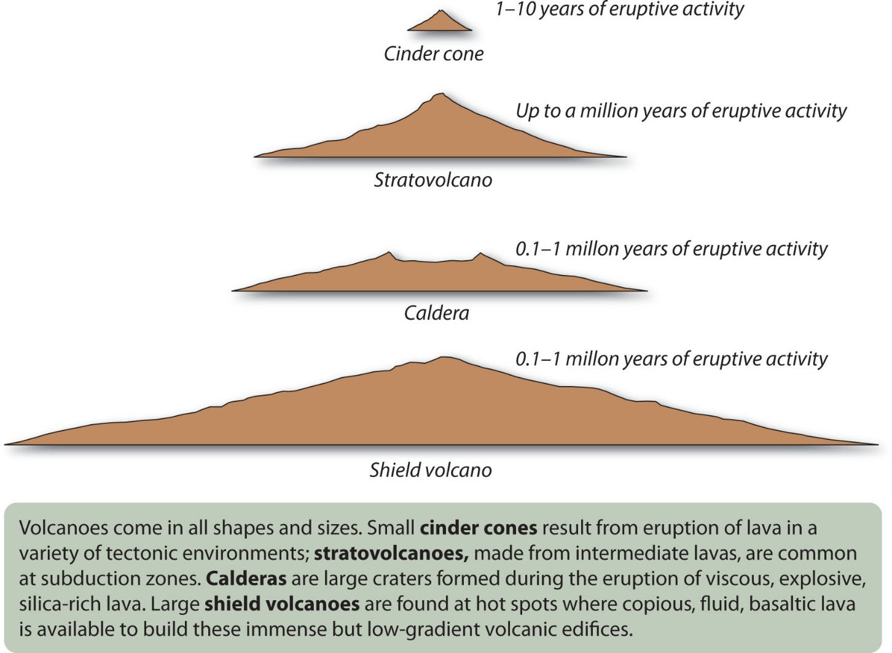

Mount St Helens:

<iframe width="560" height="315" src="https://www.youtube.com/embed/h6B1myUKAS4?si=ZuTrc7QS8fB4Kce4" title="YouTube video player" frameborder="0" allow="accelerometer; autoplay; clipboard-write; encrypted-media; gyroscope; picture-in-picture; web-share" referrerpolicy="strict-origin-when-cross-origin" allowfullscreen></iframe>

# Physical & Chemical Weathering

**2026-09-21** (missed Friday lecture)

- In geomorphoogy, exogenic vs endogenic refers more to the *origin* of the processes driving the formation of landforms (not the formation or occurrence)
- **Weathering:** breakdown of materials, from both physical (mechanical) and chemical processes
- **Erosion:** transport of weathered materials to different locations (movement) by a *fluid* medium (air/water)
- **Denudation:** any process that *wears away* landforms, resulting in decreasing the elevation and relief of a landscape (lowering the Earth's surface)
    - Include weathering, mass movement, erosion 
    - Counteracts processes like faulting and folding, which increase elevation and relief
    
## Weathering

- Physical and chemical processes that break down rock at or near Earth's surface
- Some consider biological, but these can themselves be explained by physical/chemical
- Weathering occurs because rocks are exposed to very different conditions (temperature, pressure, air/water exposure) than where they were formed
- **Mineral stability:**
    - General susceptibility of rock-forming minerals to weathering --> inverse of sequence of formation deep within Earth (**Goldich's Weathering Series**, opposite of Bowen's Reaction Series)
    - Mineral complexity or crystalline structure: 
        - Complex ionic bonds weaker than simple covalent bonds
        - SiO~2~ (quartz) very stable
        - ZrSiO~4~ (zircon) very stable, despite very high melting temperature

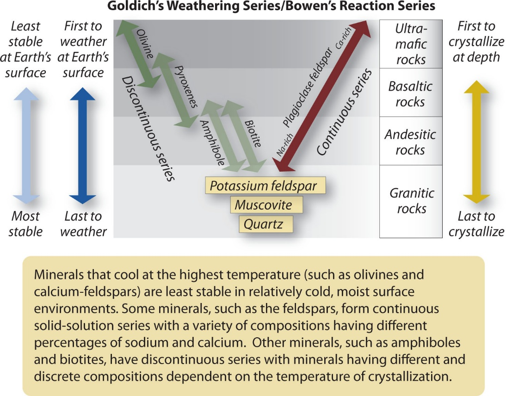

### Physical weathering

- Mechanically break the rock into smaller pieces (*disaggregation*), eventually until those particles have uniform mineral composition… then continue to reduce the size of those particles
- No change to composition of parent material
- Can occur on any **type of Earth materials (inorganic)**:
    - Bedrock: consolidated rock
    - Regolith: loose layer of material covering solid bedrock
    - Parent material: consolidated or unconsolidated material from which regolith or soils develop

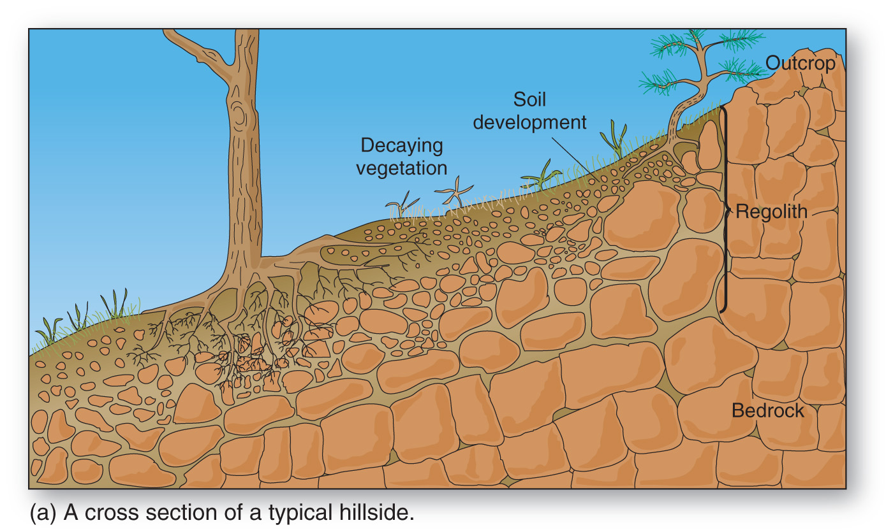

- Types/causes of physical weathering:
    - Pressure-release jointing (fracturing): 
        - Overburden covering buried rocks gradually removed by erosion, reduces confining pressure on rock, rock expands and fractures
        - Occurs concentrically and parallel to rock surface
        - **Sheeting/exfoliation:** removal of slabs of rock along joints
        - **Exfoliation dome:** landform produced when sheeting occurs in concentric shells; common in intrusive igneous rocks like granite (e.g., Half Dome in Yosemite)
    - Growth in voids
    - Thermal Stress
    - Vegetation/Roots
    - Cavitation 

<iframe width="560" height="315" src="https://www.youtube.com/embed/yAZ1V_DJKV8?si=Z3st-Y9uOjMA99qS" title="YouTube video player" frameborder="0" allow="accelerometer; autoplay; clipboard-write; encrypted-media; gyroscope; picture-in-picture; web-share" referrerpolicy="strict-origin-when-cross-origin" allowfullscreen></iframe>

(slide 18-26)

### Chemical weathering

- Rock broken down by *chemical alteration* through reactions between minerals, air, water
- Water: powerful solvent ("universal solvent")
    - Even more powerful when CO~2~ dissolved in water (becomes weakly acidic)
- Minerals: may combine with O~2~ (oxidation, rust) from atmosphere
- Reactions change primary rock-forming minerals into secondary minerals (e.g., clays), and some elements lost in solution to surface water and groundwater
    - Essential processes for biosphere (release of nutrients)
- 

#### Oxidation & reduction

- Transfer of electrons from one element to another, resulting in change in valence of primary constituents
- Oxidation: loss of electron (weakens mineral); reduction: gain of electron
- Redox potential (Eh): capacity of oxidation to occur; higher Eh indicate greater affinity for electrons (tendency for oxidation)
- Pyrite (fools' gold, iron disulphide) is commonly associated with coal deposits; results in *acid mine drainage* when pH rises above 3, precipitating iron oxide
    - Abandoned mine drainage treatment: [see example](https://youtu.be/GCn3g0T1qys?si=d5xnmb4Kp2umAgpw)

#### Solution/dissolution

- Transfer of mass from solid to aqueous state
- **Congruent dissolution:** all constituents of individual molecule separated and remain in solution
- **Incongruent:** some released ions recombine to create new compounds and secondary minerals

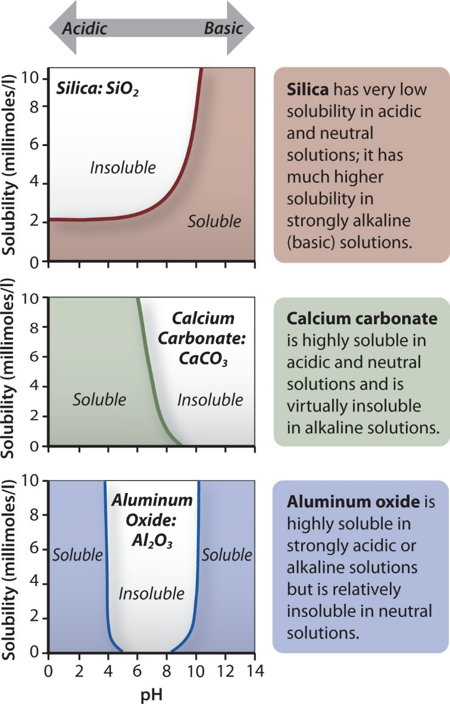

- Calcite dissolution is reversible: as broken down carbonates travel further down and if they reach some underground cavity, conditions different (evaporation, increased pH, decreased CO~2~), and they precipitate calcite again (cave geomorphology, speleothems)

#### Hydrolysis

- Minerals combine with water to form new compounds; **not reversible**
- Important for silicate minerals (e.g., granite)
- Causes granulation and produces secondary clay minerals
- Aluminosilicate + water --> clay mineral + cation + silicic acid
- **Clay formation and mineralogy:**
    - Clay minerals are layered silicates; sheets of alumina octahedral and silica tetrahedral in either 1:1 or 1:2 structure
    - TOT structure has weaker bonds, due to T-T sheet connections, so greater area for processes
    - Shrink/swell clays: shrink when dry and expand when wet
    - Lateritic residuum: mineral at the end of weathering sequence; signifies long weathering process and low soil fertility

#### Hydration

- Incorporation of water molecules into crystal structure of minerals
- Sometimes considered as physical weather, but here consider as chemical because occurs at lattice level
- Reversible
- Gypsum vs anhydrite: gypsum very soft, anhydrite much harder

### Factors affecting weathering

- Climate: temperature & moisture
- Rock composition/structure
- Presence/absence of joints/fractures: teamwork of initial physical that increases surface area for chemical to work on and round off sharp edges (**spheroidal weathering**)
- Vegetation: root wedging (physical) + organic acids (chemical)
- Geographic orientation: relative to sun
    - N-facing slopes in N hemisphere cooler, moister, more vegetated (different species)
- Global change

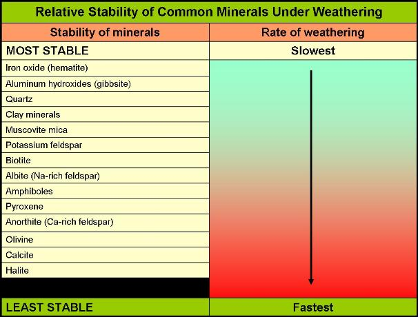

## Karst landscapes & caves

**2026-09-23**

- Limestone and marble (metamorphosed limestone) dissolve easily in weakly acidic environments; carbonic acid abundant in environment (H^+^ and CO~2~)
    - Depends on partial pressure of CO~2~, so soil water highly effective
- **Karst:** distinctive landscape that forms from highly soluble rocks, usually limestone
    - Unique drainage pattern resulting from karst processes
    - Slavic-Italian (*kras-carso*): bleak waterless place, or bare rock surface
    - When water falls on surface, tends to go belowground quickly
    - Classical description from high Kras plateau near Adriatic Sea, Slovenia; closed depressions, interrupted stream valleys
    - Much broader term now; about 15% of Earth's land area has karst features
    - Louisiana has no limestone, but some halite landscapes; considered evaporite, together with gypsum
    - Dolomite (MgCO~3~) has Mg instead of Ca
    
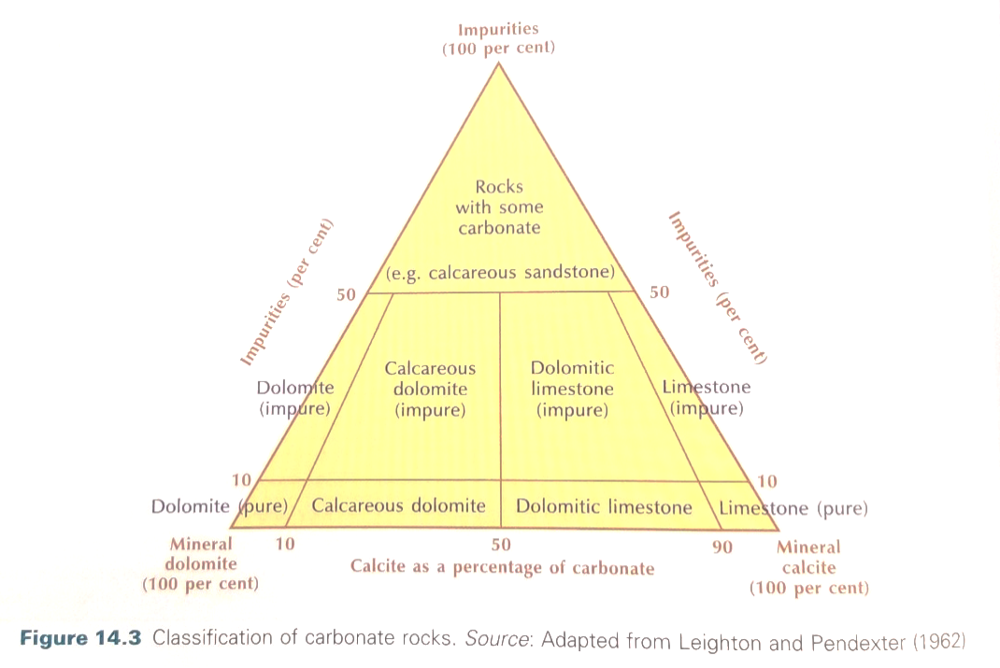

### Karst landforms

- **Karren:** umbrella term; small-scale solutional features on carbonates surfaces exposed at ground surface or in caves
- **Closed depressions:** aka sinkhole; shallow depressions that form from dissolution near (on or below) the surface
    - Solutional (top-down) vs collapse (bottom-up)
    - Sinkholes (dolines)/collapse can be very destructive 
        - Florida is sinkhole alley ([old news](https://youtu.be/WuMFT97sTSE?si=PpCkjXeQuDswKym4))
        - Lake Peigneur, LA ([swallowed a lake](https://youtu.be/CmHpNTYYWcM?si=e0kGviYAH_7cXTZt))
        - Salt drilling: no need to mine underground, just pump water underground, dissolve salt, then pump back out
- **Grotto:** natural caves near coast/water
- **Solution valley:** series of connected sinkholes
- **Disappearing streams:** water enters cavity and flows underground

### Tropical karst landscapes

- More precipitation; more soil and vegetation, warmer temperatures
- **Cockpit karst:** like closed depressions, but more pronounced hills between (top-down)
- **Tower karst:** steep-sided, may not have vegetation (e.g., Guilin, China)

### Caves and speleothems

- **Speleothem:** secondary mineral deposit
- Typically limestone, dolomite, gypsum
- Stalactites (ceiling), stalagmites (ground)
- Different shapes
- Other acids can form as well: sulphuric acid dissolving limestone, and precipitating to calcium sulphate (gypsum). e.g., Carlsbad Caverns in NM

<iframe width="560" height="315" src="https://www.youtube.com/embed/wgUFb_l4DLE?si=KGSg1fWSQN3euvUN" title="YouTube video player" frameborder="0" allow="accelerometer; autoplay; clipboard-write; encrypted-media; gyroscope; picture-in-picture; web-share" referrerpolicy="strict-origin-when-cross-origin" allowfullscreen></iframe>

# Soil Geomorphology

**2026-09-25**

- How is soil different from just sediment?
    - Inorganic vs organic
    - **Regolith:** layer of fragmented, unconsolidated mineral and rock, either residual or transported, that occurs almost everywhere
    - **Soil:** *chemically and mechanically weathered* and/or altered regolith capable of sustaining plant life. Dynamic system composed of fine organic and mineral fragments which interacts with plants, animals, water, humans...
    - 50% mineral + organic matter, 50% air + water in pore space
    - Darker --> more organic content
    - *Open system:* inputs (insolation, water, rock/sediment, microorganisms) and outputs (plant ecosystems, filtered water, nutrients)
- Basis for ecosystem function:
    - Retain and filter water
    - Habitat for microbial organisms and others
    - Source for slow-release of nutrients
    - Storage sink for carbon: soil carbon pool 3 times larger than atmospheric carbon pool!
    - ~2/3 recent increase in atmospheric carbon comes directly from burning fossil-fuels, ~1/3 comes from loss of soil
    - Desertification
- Soil forming factors (Hans Jenny): CLORPT (climate, organisms, relief, parent material, time)
    - Climate: greater moisture and temperatue --> faster chemical weathering
    - Relief: slope, elevation, orientation. High slope: more erosion, thinner layers with less organic matter. Elevation: temperature & precipitation. Orientation: effective insolation. 
    - Time: takes 200-1000 years for 1 inch of soil to form
    - Could also add H for Humans: climate change, fertilisers, intensive agriculture, etc.
- Soil production: rate at which bedrock broken down into erodible material forming soil
    - Depends on soil residence time (between mineral grain's initial weathering to erosion/removal from slope)
    - Soil thickness depends on equilbrium between soil production (rock weathering) and soil erosion (transport)
    - Steepest slopes typically have poor soils, while the base of that slope receives that eroded soil and has great soils
    - **Regolith production:** in many landscapes, production rate exponentially decreases with depth/thickness of existing regolith (separation from atmosphere). On the other hand, in landscapes where regolith production more strongly controlled by regolith water content (chemical weathering processes), the peak may be at intermediate cover thickness, so might get a right-skewed pattern.

## Basic terminology

- **Pedon:** smallest unit of soil that represents all the characteristics and variability used for classification (volume)
- **Soil profile:** vertical section from surface to the deepest extent of plant roots or to the point where regolith or bedrock is encountered
- **Soil horizons:** distinct horizontal layers organized within the soil profile
- **Solum:** true definable soil (horizons A, E, B) in a profile, without regolith/bedrock below

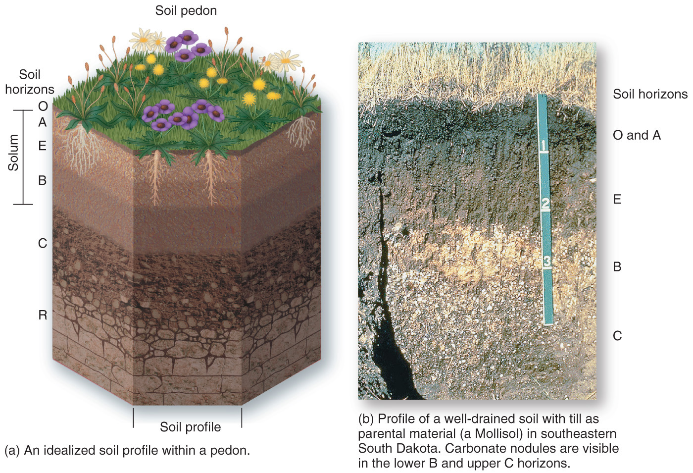

## Soil Properties

- Colour
    - Suggests composition and chemical makeup, but can de deceptive
    - Use hue, value, chroma
    - Munsell Color Chart (175 colours)
- Texture 
    - Distribution/proportion of particle sizes (inorganic/mineral sizes) within soil
    - Anything >2 mm is not soil, it's gravel or larger
    - So how much sand, silt and clay proportionally? Sieve analysis
    - **Loam:** somewhat even mix of sand, silt, clay
    
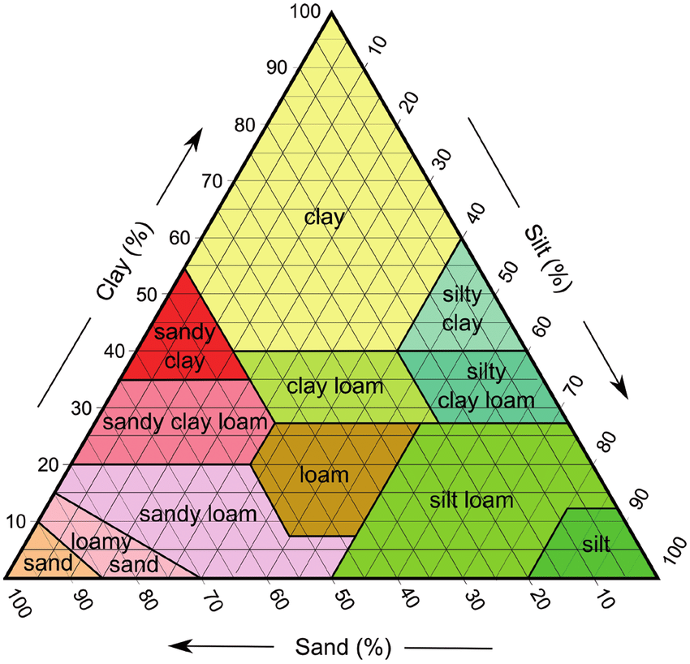

- Structure
    - Size and shape of aggregates of soil particles
    - Smallest natural lump/cluster is called **ped**
    - Shape of peds determines structure type (crumn/granular, platy, blocky, prismatic, columnar)
    - How peds separate determines porosity (rounded peds more pore space, greater permeability, better for plant growth)
- Consistency
    - Cohesion of soil particles
    - Product of texture (particle size) and structure (ped shape)
    - Resistance to breaking and manipulation under varying moisture
    - Wet, plasticity, friable, firm
- Porosity
    - Measure of empty spaces in soil; ratio of empty (pore) volume to total volume
    - Permeability: connectedness of pore spaces
- Moisture
    - Somewhat vague; definition depends on discipline
    - Soil scientists: water in pore spaces (field capacity, wilting point, capillary action)
    Hygroscopic water – inaccessible to plants, molecule-thin layer
    - **Capillary water:** water held by surface tension between particles against gravity, available for plants
    - **Field capacity:** amount of water remaining in the soil a few days (48 hours) after rainfall and percolation has ceased
    - **Wilting point:** only hygroscopic water remains in soil
    - **Available water capacity (AWC):** total quantity of water that can be held in a soil for plants
    - Capillary water is more important for plants than gravitational water, so need greatest time between field capacity and wilting point
    
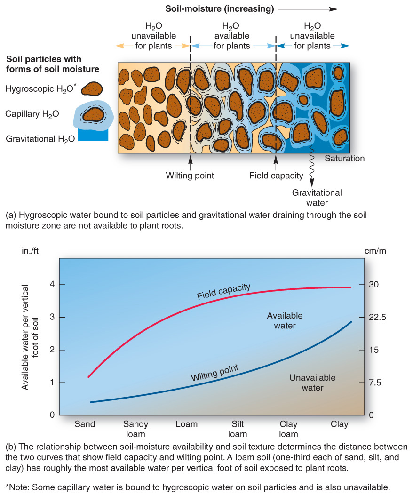

- Chemistry